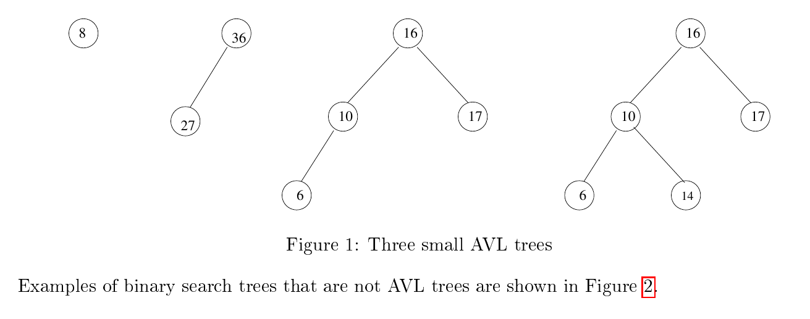
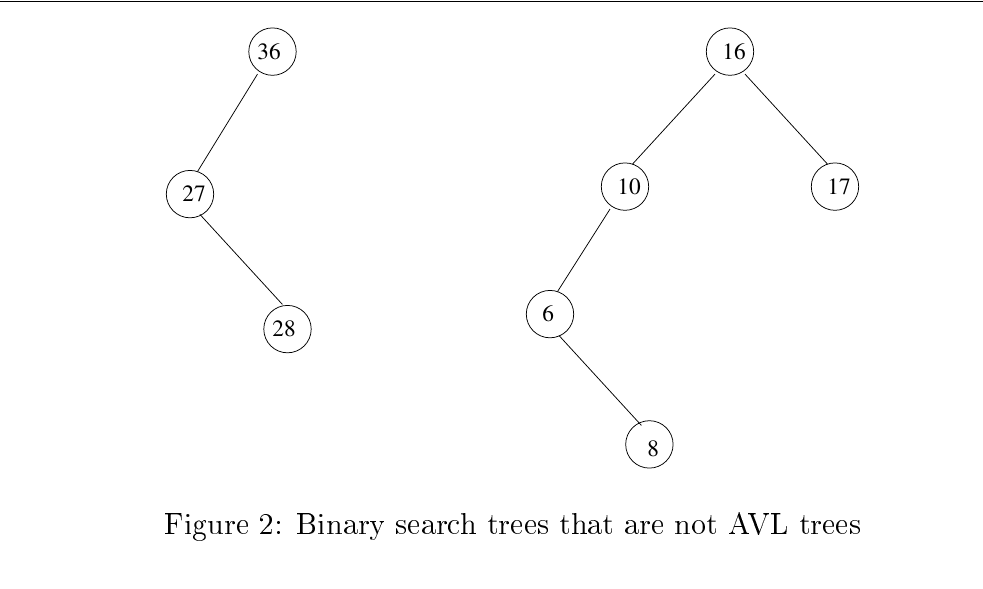
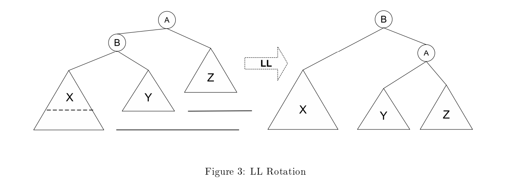

# Balanced Trees

## AVL Trees

We could define a perfectly balanced binary search tree with N nodes to be a complete binary
search tree, one in which every level except the last is completely full. A perfectly balanced BST
would have guaranteed O(logN) search time. Unfortunately it is too costly to rebalance such a tree
after each insertion and deletion. We need a tree with a weaker balancing condition. An AVL tree
is such a tree. An AVL tree (AVL for the names of its inventors, Adelson-Velskii and Landis) is a
binary search tree with a balancing condition that is relatively inexpensive to maintain.

**Definition 1.** An AVL tree is a binary search tree in which, for every node in the tree, the
heights of the left and right subtrees of the node differ by at most 1. This is called the *balancing
condition*.

> **Note:** We will see that a consequence of this definition is that the height of an AVL tree with N
> nodes, even in the worst case, is proportional to logN.

For the sake of precision, we will define the balance factor at a node as the height of the left
subtree of that node minus the height of the right subtree of that node.

Examples of binary search trees that are not AVL trees are shown in the next figure.

## AVL Tree Search

A search takes O(h) time, where h is the height of the tree. This is because an AVL tree is a binary
search tree and the search algorithm is the same for both trees. This is the easy part. Because the
height of an AVL tree is at worst O(logN), searching takes O(logN) time in the worst case.

We will establish this later in this chapter.

### AVL Tree Insertion

When an element is inserted into a tree, whether as a left child or a right child of some node p, the
height of the tree rooted at p may or may not increase. If p had a left child but no right child, and
the new node is p's new right child, the tree rooted at p does not change height as a result of the
insertion. But if p had no children at all and this is a new child, then p's tree increased height by
1. In this case it is possible that the tree rooted at the parent of p increased in height as well, and
that the tree rooted at the grandparent of p increased in height as well.

If you look at the trees in Figure 1 and imagine inserting a node containing 4 as the left child of 6 in either of the two
rightmost trees, you can see that each of the trees all of the way up the path to the root increased
in height. On the other hand, if you insert 18 as the right child of 17, then the tree rooted at 17
increases in height but not that of its parent.

We can conclude that an insertion might increase the height of one or more subtrees by 1. This
will change the balance factors of the trees on the path up to the root from the point of insertion.
Some of the trees will stay balanced, meaning their balance factors are -1, 0, or 1, whereas others
may now have a balance factor of -2 or +2.

For example, consider the tree that is the second from the right in Figure 1. If we give a new left child to node 6, then its balance factor changes from 0 to 1 and the balance factor of the node containing 10 changes from 1 to 2.

Consider traveling up the tree from the point of insertion, inspecting the balance condition at each
node. The first node found that is out of balance (not -1, 0, or 1) can be out of balance in one of four
ways. An analysis shows that of the four different cases, two are symmetric. There are therefore
two theoretical cases and their symmetric counterparts. Let A be the node of greatest depth that is
out of balance, meaning the first one found while traveling up the path from the point of insertion.

The four possibilities are:

1. The insertion was in the left subtree of the left child of A  
2. The insertion was in the right subtree of the left child of A  
3. The insertion was in the left subtree of the right child of A  
4. The insertion was in the right subtree of the right child of A  

We will see that there are four different rebalancing algorithms that restore the AVL tree's balance
condition at all of its nodes. For now, these algorithms will be known as the LL, RR, RL, and LR
rotations. Soon they will be explained.
Cases 1 and 4 are symmetric and are resolved with an LL or RR rebalancing respectively. Cases 2
and 3 are symmetric and are resolved with an LR or RL rebalancing respectively.

## Attribution
This repository contains derivative work based on course materials by Professor Stewart Weiss for CSCI 335 at Hunter College, CUNY, Spring 2019.

Original materials are available at: [https://www.cs.hunter.cuny.edu/~sweiss/course_materials/csci335/csci335_s19.php](https://www.cs.hunter.cuny.edu/~sweiss/course_materials/csci335/csci335_s19.php)

The original work is licensed under the [Creative Commons Attribution-ShareAlike 4.0 International License (CC BY-SA 4.0)](https://creativecommons.org/licenses/by-sa/4.0/).  
This repository is licensed under the same license. Changes include summarization, reorganization, and additional commentary.
